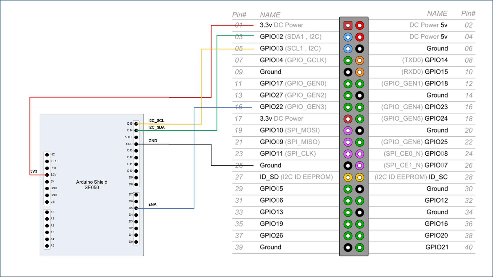

# PKCS11 for EdgeLock SE05x Secure Elements

Depending on the capabilities of the attached secure element (e.g. SE050_C, SE051E, ...)
the following functionality can be made available over the pkcs11 interface (sss pkcs11).

- EC crypto (nist192, nist256, secp384r1, secp521r1)
  - EC key generation
  - EC sign/verify
  - ECDH compute key
- RSA crypto (RSA 1024, 2048, 3072, 4096)
  - RSA key generation (Plain Key)
  - RSA sign/verify
- Random generator
- Object import/delete/export (public part) of:
  - EC key
  - RSA key
  - Certificate
- Message digest (SHA1, SHA224, SHA256, SHA384, SHA512)
- Symmetric key generation


The SSS PKCS11 library here is tested with OpenSC pkcs11 tool.

SSS PKCS11 library is tested on Raspberry Pi (Raspberry Pi 4 Model B, Ubuntu 22.04.2 LTS)


## Getting Started on Raspberry Pi

### Prerequisite

- Raspberry pi with Ubuntu 22.04.2 LTS installed
- cmake installed - `sudo apt-get install cmake`
- OpenSC pkcs11 tool installed - `sudo apt-get install opensc-pkcs11`
- SE05x secure element connected to Raspberry Pi on i2c-0 port

<p align=left>

</p>

Enable pin configuration for SE05X - connect GPIO22 (P1_15) to ENA pin of SE05X as indicated in the image above.


### Build
Run the commands below to build PKCS11 library for SE05x secure element

```console
git clone --recurse-submodules git@github.com:NXPPlugNTrust/se05x-pkcs11.git
cd se05x-pkcs11
mkdir build
cd build
cmake ../
cmake --build .
cmake --install .
```

Refer ``CMAKE Options section`` in ``simw_lib\README.rst`` to build PKCS11 library with different session authentication.


## Testing SSS PKCS11

### Random Number Generation

```console
pkcs11-tool --module /usr/local/lib/libsss_pkcs11.so --generate-random 32 -o random_data.txt

```

### ECC (Nist256) Key Generation

```console
pkcs11-tool --module /usr/local/lib/libsss_pkcs11.so --keypairgen --key-type  EC:prime256v1 --label sss:0xEF000001

```

OR

```console
pkcs11-tool --module /usr/local/lib/libsss_pkcs11.so --keypairgen --key-type  EC:prime256v1 --id 78563412

```

---

When passing the key id using CKA_ID attribute (--id), currently the key id has to be passed with endianness changed. Example id 12345678 has to be passed as - `--id 78563412`

---

Supported curves
  - nist192
  - nist256
  - secp384r1
  - secp521r1


### Extract public key from SE

```console
pkcs11-tool --module /usr/local/lib/libsss_pkcs11.so --read-object --type pubkey --label sss:0xEF000001 -o 0xEF000001_public.key

```

### ECDSA - Sign Operation (On hash data)

```console
pkcs11-tool --module /usr/local/lib/libsss_pkcs11.so --sign --mechanism ECDSA --label sss:0xEF000001 --input-file scripts/input/data32.txt -o out.sign

```

### ECDSA - Sign Operation (On raw input)

```console
pkcs11-tool --module /usr/local/lib/libsss_pkcs11.so --sign --mechanism ECDSA-SHA256 --label sss:0xEF000001 --input-file scripts/input/data1024.txt -o out.sign

```

### RSA (1024) Key Generation

```console
pkcs11-tool --module /usr/local/lib/libsss_pkcs11.so --keypairgen --key-type  rsa:1024 --label sss:0xEF000002

```

---

In the current implementation of SE05x PKCS11 module, the RSA key gnerated is of plain type.

---

### Message Digest

```console
pkcs11-tool --module /usr/local/lib/libsss_pkcs11.so --hash --mechanism SHA256 --input-file scripts/input_data/data64.txt --output-file scripts/output/out_hash_SHA256.txt

```

---

It should be noted that message digest when performed with multi-step operation, will result in flash writes.

---


## Example Scripts for SSS PKCS11 Library

The directory ``<root>/scripts`` contains a set of python scripts.
These scripts use the SSS PKCS11 library in the context of OpenSC  tool.
They illustrate using the SSS PKCS11 library for fetching
random data, EC or RSA crypto operations.
The scripts assume the secure element is connected via I2C to the host.

```console
# Random number generation
python pkcs11_random_gen.py

# ECC Key generation
python pkcs11_ecc_key_gen.py

# ECDSA Operations
python pkcs11_ecc_sign_verify.py

# RSA Key generation
python pkcs11_rsa_key_gen.py

# RSA Sign and Verify
python pkcs11_rsa_sign_verify.py

# Import objects
python pkcs11_import_object.py

# Message Digest
# It should be noted that message digest when performed with multi-step operation, will result in flash writes.
python pkcs11_message_digest.py

# Symmetric key generate
# (Invoke random number generation and set key)
python pkcs11_sym_key_gen.py

```